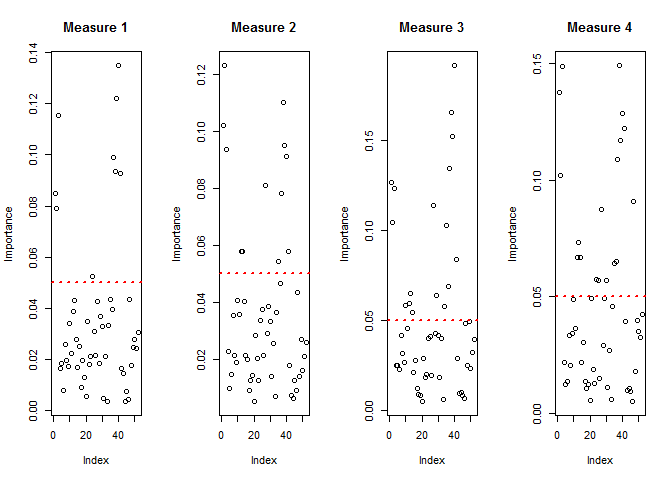

## Introduction
The data for this project come from this source: http://groupware.les.inf.puc-rio.br/har. 

Citation:
Velloso, E.; Bulling, A.; Gellersen, H.; Ugulino, W.; Fuks, H. Qualitative Activity Recognition of Weight Lifting Exercises. Proceedings of 4th International Conference in Cooperation with SIGCHI (Augmented Human '13) . Stuttgart, Germany: ACM SIGCHI, 2013.

Read more: http://groupware.les.inf.puc-rio.br/har#ixzz5Cr37qrCu

This report is the write up of the end-of-class project in the Practical Machine Learning Coursera course. Quoting from the course website, the purpose of this assignment is as follows.
"One thing that people regularly do is quantify how much of a particular activity they do, but they rarely quantify how well they do it. In this project, your goal will be to use data from accelerometers on the belt, forearm, arm, and dumbell of 6 participants."

This report attempt to predict how well someone does the exercises based on the data from the accelerometers on the arm, forearm belot and dumbbell of participants. Quoting from the above website:
"Six young healthy participants were asked to perform one set of 10 repetitions of the Unilateral Dumbbell Biceps Curl in five different fashions: exactly according to the specification (Class A), throwing the elbows to the front (Class B), lifting the dumbbell only halfway (Class C), lowering the dumbbell only halfway (Class D) and throwing the hips to the front (Class E)."
This project looks at the accelerometer data and predicts whether the particpant was performing the activity according to Class A, B, C, D, or E.

## Load needed libraries

```r
library(caret)
```

```
## Warning: package 'caret' was built under R version 3.4.4
```

```
## Loading required package: lattice
```

```
## Loading required package: ggplot2
```

```r
library(ggplot2)
library(Hmisc)
```

```
## Warning: package 'Hmisc' was built under R version 3.4.4
```

```
## Loading required package: survival
```

```
## 
## Attaching package: 'survival'
```

```
## The following object is masked from 'package:caret':
## 
##     cluster
```

```
## Loading required package: Formula
```

```
## 
## Attaching package: 'Hmisc'
```

```
## The following objects are masked from 'package:base':
## 
##     format.pval, units
```

```r
library(rattle)
```

```
## Warning: package 'rattle' was built under R version 3.4.4
```

```
## Rattle: A free graphical interface for data science with R.
## Version 5.1.0 Copyright (c) 2006-2017 Togaware Pty Ltd.
## Type 'rattle()' to shake, rattle, and roll your data.
```

```r
library(RANN)
```

```
## Warning: package 'RANN' was built under R version 3.4.4
```

```r
library(GGally)
```

```
## Warning: package 'GGally' was built under R version 3.4.4
```

```r
library(randomForest)
```

```
## Warning: package 'randomForest' was built under R version 3.4.4
```

```
## randomForest 4.6-14
```

```
## Type rfNews() to see new features/changes/bug fixes.
```

```
## 
## Attaching package: 'randomForest'
```

```
## The following object is masked from 'package:rattle':
## 
##     importance
```

```
## The following object is masked from 'package:ggplot2':
## 
##     margin
```

```r
library(rpart)
library(rpart.plot)
```

```
## Warning: package 'rpart.plot' was built under R version 3.4.4
```
## Read in the data from the web

```r
trainURL<-"https://d396qusza40orc.cloudfront.net/predmachlearn/pml-training.csv"
testURL<-"https://d396qusza40orc.cloudfront.net/predmachlearn/pml-testing.csv"
download.file(trainURL, destfile="~/barbelltrain.csv")
download.file(testURL, destfile="~/barbelltest.csv")
barbelldata<-read.csv("~/barbelltrain.csv", header=T, na.strings=c("","NA"))
testcases<-read.csv("~/barbelltest.csv", header=T, na.strings=c("","NA"))
```

##Preprocess the data
In this code chunk we preprocess the data. Because of many missing data values (over 1,000,000 NA values in the training data), we need to standardize the data by imputation. In the training data, we use knn imputation to deal with NA values. We also subset the data to remove any columns from the test data that only have NA values. We also subset the training data to remove rows with subject names and time stamps. For the test data, we remove the column with index number and remove any columns that do not contain any data points. After these preprocessing steps, the data has been refined to have 59 predictors, which is an improvement that will lead to less overfitting when we build a model.


```r
preObj<-preProcess(barbelldata[,-160], method="knnImpute")
barbelldata[,-160]<-predict(preObj, barbelldata[,-160])
barbelldata<-barbelldata[, !apply(is.na(testcases), 2, all)]
barbelldata<-barbelldata[,8:60]
testcases<-testcases[,-160]
testcases<-testcases[, !apply(is.na(testcases), 2, all)]
```

## Cross validation
In this code chunk the training data is partitioned into a training set and a testing set. This provides cross validation for the models built.

```r
set.seed(1245)
inTrain<-createDataPartition(y=barbelldata$classe, p=0.7, list=FALSE)
training<-barbelldata[inTrain,]
testing<-barbelldata[-inTrain,]
```

## Data Exploration
In this code chunk, the data is explored by making a random forest model and then checking the importance of each variable in the model. A plot is made to illustrate the importance.

```r
set.seed(1234)
model <-randomForest(classe ~., data = training, importance = TRUE)
y1=model$importance[,1]
y2=model$importance[,2]
y3=model$importance[,3]
y4=model$importance[,4]
par(mfrow=c(1,4))
plot(y1, main = paste("Measure", 1), ylab="Importance")
abline(h=0.05,col="red",lty=3, lwd = 2)
plot(y2, main = paste("Measure", 2), ylab="Importance")
abline(h=0.05,col="red",lty=3, lwd = 2)
plot(y3, main = paste("Measure", 3), ylab="Importance")
abline(h=0.05,col="red",lty=3, lwd = 2)
plot(y4, main = paste("Measure", 4), ylab="Importance")
abline(h=0.05,col="red",lty=3, lwd = 2)
```

<!-- -->

```r
important<- c(names(y1[y1>.05]), names(y2[y2>.05]), names(y3[y3>.05]), names(y4[y4>.05]))
sort(important, dec = TRUE)
```

```
##  [1] "yaw_dumbbell"         "yaw_belt"             "yaw_belt"            
##  [4] "yaw_belt"             "yaw_belt"             "total_accel_dumbbell"
##  [7] "roll_forearm"         "roll_forearm"         "roll_forearm"        
## [10] "roll_forearm"         "roll_dumbbell"        "roll_dumbbell"       
## [13] "roll_dumbbell"        "roll_belt"            "roll_belt"           
## [16] "roll_belt"            "roll_belt"            "roll_arm"            
## [19] "roll_arm"             "pitch_forearm"        "pitch_forearm"       
## [22] "pitch_forearm"        "pitch_forearm"        "pitch_belt"          
## [25] "pitch_belt"           "pitch_belt"           "pitch_belt"          
## [28] "magnet_dumbbell_z"    "magnet_dumbbell_z"    "magnet_dumbbell_z"   
## [31] "magnet_dumbbell_z"    "magnet_dumbbell_y"    "magnet_dumbbell_y"   
## [34] "magnet_dumbbell_y"    "magnet_dumbbell_y"    "magnet_dumbbell_x"   
## [37] "magnet_dumbbell_x"    "magnet_dumbbell_x"    "magnet_dumbbell_x"   
## [40] "magnet_belt_z"        "magnet_belt_z"        "magnet_belt_z"       
## [43] "magnet_belt_y"        "magnet_belt_y"        "magnet_belt_y"       
## [46] "magnet_arm_y"         "magnet_arm_x"         "magnet_arm_x"        
## [49] "accel_forearm_x"      "accel_dumbbell_z"     "accel_dumbbell_z"    
## [52] "accel_dumbbell_y"     "accel_dumbbell_y"     "accel_dumbbell_y"    
## [55] "accel_dumbbell_x"     "accel_belt_z"
```

```r
important<-unique(important)
important
```

```
##  [1] "roll_belt"            "pitch_belt"           "yaw_belt"            
##  [4] "magnet_arm_x"         "magnet_dumbbell_x"    "magnet_dumbbell_y"   
##  [7] "magnet_dumbbell_z"    "roll_forearm"         "pitch_forearm"       
## [10] "magnet_belt_y"        "magnet_belt_z"        "roll_dumbbell"       
## [13] "accel_dumbbell_y"     "accel_belt_z"         "roll_arm"            
## [16] "yaw_dumbbell"         "accel_dumbbell_x"     "accel_dumbbell_z"    
## [19] "magnet_arm_y"         "total_accel_dumbbell" "accel_forearm_x"
```

##Models
In the next code chunk, three refined random forest models are made by limiting to the most important predictors as defined by the exploration above. Since we are tring to predict a factor variable (Class A, B, C, D, or E) a random forest model makes the most sense. In addition, Principal Component Analysis (PCA) is used in the analysis since it is likely that some of the variables are highly correlated. Finally, the first model is tested on the testing data set. A confusion matrix is generated to view the accuracy. Finally, to answer the quiz prediction questions, the refined model is used to predict the outcome for the 20 test cases.

```r
set.seed(5678)
refinedmodel <-train(classe ~roll_belt+pitch_belt+yaw_belt+
                                magnet_dumbbell_x+magnet_dumbbell_y+
                                magnet_dumbbell_z+ roll_forearm+
                                pitch_forearm+roll_dumbbell+
                                accel_dumbbell_y+accel_forearm_x, data = 
                                training, method="rf", preprocess="pca", 
                                verbose=FALSE)
refinedmodel2<-randomForest(classe ~roll_belt+pitch_belt+yaw_belt+magnet_arm_x+
                                magnet_dumbbell_x+magnet_dumbbell_y+
                                magnet_dumbbell_z+ roll_forearm+
                                pitch_forearm 
                                +magnet_belt_y+magnet_belt_z
                                +roll_dumbbell+
                                accel_dumbbell_y+accel_belt_z + 
                                +roll_arm+ yaw_dumbbell +
                                accel_dumbbell_x+ accel_dumbbell_z +
                                magnet_arm_y + total_accel_dumbbell + 
                                accel_forearm_x, data = 
                                training, 
                                verbose=FALSE)
refindedmodel3<-rpart(classe ~roll_belt+pitch_belt+yaw_belt+magnet_arm_x+
                                magnet_dumbbell_x+magnet_dumbbell_y+
                                magnet_dumbbell_z+ roll_forearm+
                                pitch_forearm 
                                +magnet_belt_y+magnet_belt_z
                                +roll_dumbbell+
                                accel_dumbbell_y+accel_belt_z + 
                                +roll_arm+ yaw_dumbbell +
                                accel_dumbbell_x+ accel_dumbbell_z +
                                magnet_arm_y + total_accel_dumbbell + 
                                accel_forearm_x, data = 
                                training, 
                                method="class")
pred<-predict(refinedmodel, newdata=testing)
confusionMatrix(testing$classe, pred)
```

```
## Confusion Matrix and Statistics
## 
##           Reference
## Prediction    A    B    C    D    E
##          A 1660   11    2    1    0
##          B   10 1104   23    2    0
##          C    0    7 1017    2    0
##          D    0    2    9  952    1
##          E    0    6    3    6 1067
## 
## Overall Statistics
##                                           
##                Accuracy : 0.9856          
##                  95% CI : (0.9822, 0.9884)
##     No Information Rate : 0.2838          
##     P-Value [Acc > NIR] : < 2.2e-16       
##                                           
##                   Kappa : 0.9817          
##  Mcnemar's Test P-Value : NA              
## 
## Statistics by Class:
## 
##                      Class: A Class: B Class: C Class: D Class: E
## Sensitivity            0.9940   0.9770   0.9649   0.9886   0.9991
## Specificity            0.9967   0.9926   0.9981   0.9976   0.9969
## Pos Pred Value         0.9916   0.9693   0.9912   0.9876   0.9861
## Neg Pred Value         0.9976   0.9945   0.9924   0.9978   0.9998
## Prevalence             0.2838   0.1920   0.1791   0.1636   0.1815
## Detection Rate         0.2821   0.1876   0.1728   0.1618   0.1813
## Detection Prevalence   0.2845   0.1935   0.1743   0.1638   0.1839
## Balanced Accuracy      0.9953   0.9848   0.9815   0.9931   0.9980
```

```r
predtestcases<-predict(refinedmodel, newdata = testcases)
predtestcases
```

```
##  [1] E A A E E E E B B E B A B A E E E B E E
## Levels: A B C D E
```
Based on the confusion matrix, the model is predicted to have a 98.56% out-of-sample error rate of .
